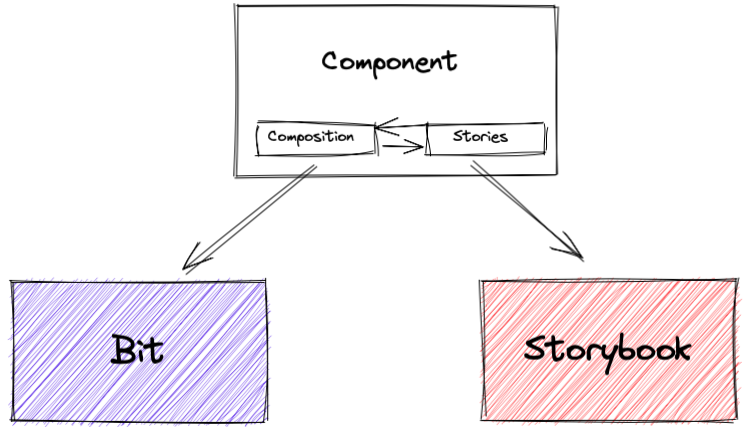
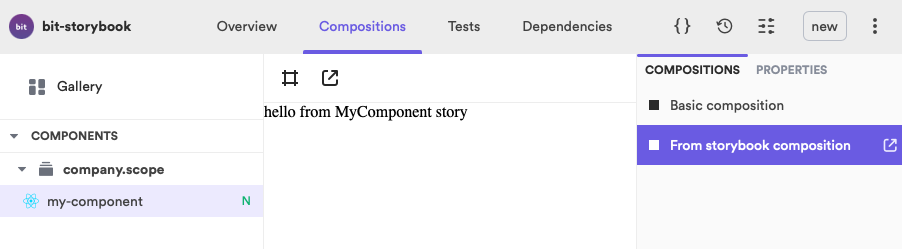

# Bit <> Storybook

You can run Bit and Storybook in the same projects and render the UI components in both tools. As Bit and Storybook both use [Component Story Format](https://github.com/ComponentDriven/csf) for rendering, this means that we can use stories in compositions and vice versa.

This way you can use Bit as a platform for managing component lifecycle and independent publishing, and use Storybook for its more advanced rendering features.



Rendering a story in a Bit Component Composition



> **Note:** Bit can manage the lifecycle of non-UI components like Hook (React), Node (Utils, SDKs) and others. These components are likely not to be rendered in Storybook, but can still be used in stories as needed.

If you would like to clone the project to take it for a test run make sure you have [bit installed](https://harmony-docs.bit.dev/docs/bit/installation).

```sh
git clone git@github.com:bit-demos/bit-storybook.git
cd bit-storybook
bit install
```

You can run any of the servers to show components:

* Run the Bit server

```sh
bit start
```

* Run the Storybook server

```sh
yarn storybook
```

## Rendering a `composition` in a `story`

You can directly import a composition and render in a story:

```js
import { BasicComposition } from './my-component.composition';

export const FromCompositionStory = () => (
  <BasicComposition />
);
```

> Example in `scope/my-component/my-component.stories.tsx`

## Rendering a `story` in a `composition`

You can directly import a story and render in a composition:

```js
import { BasicStory } from './my-component.stories';

export const FromStorybookComposition = () => (
  <BasicStory />
);
```

> Example in `scope/my-component/my-component.composition.tsx`

## Adding storybook to a Bit workspace

If you don't have a Bit workspace, run this command:

```sh
bit new react-workspace my-workspace
cd my-workspace
```

To use storybook we'll need to create a `package.json` file for it's `init` command to run:

```sh
npm init -y
npx sb init
```

Storybook will be installed as a dependency of the workspace, generate base components and add a configuration.  
We should remove the template Storybook components:

```sh
rm -rf stories
```

As part of it's setup process, Storybook adds some dependencies to the `package.json` file. We'll need to:

1. Open `package.json` file and cut all dependencies from there.
1. Open `workspace.json` file and add the dependencies to the dependency policy.

The list of dependencies varies between different Storybook setups according to the framework.

The last step is to configure Storybook to find story files across the repository. Open the `.storybook/main.js` and change the `stories` array to:

```js
module.exports = {
  "stories": [
    "../**/*.stories.mdx",
    "../**/*.stories.@(js|jsx|ts|tsx)"
  ],
}
```

Once you have the setup complete, remove `node_modules` and install workspace dependencies with Bit.

```sh
rm -rf node_modules
bit install
```

Now you can start adding `*.stories.*` files to any of your components.
